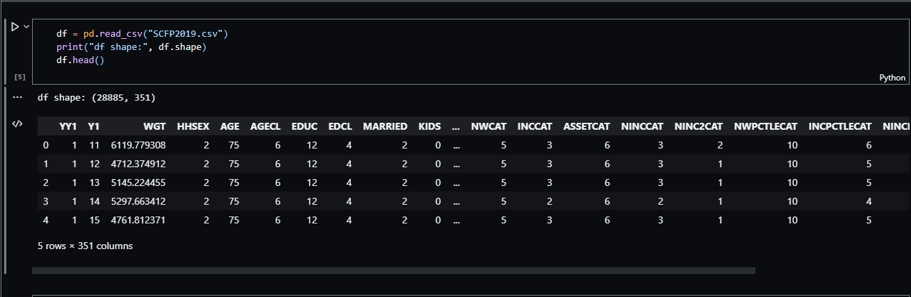

# [Customer-Segmentation-in-the-US](https://github.com/sehmilo/Customer-Segmentation-in-the-US/blob/main/fed_reserve.ipynb)

Data Science Project

# Table of Contents
1. [Overview](#Overview)
2. [About](#About)
3. [Dataframe Structure](#Dataframe-Structure)
4. [Data Dictionary](#Data-Dictionary*)
6. [Acknowledgement](#Acknowlegdement)

# Overview
In this [project](https://github.com/sehmilo/Customer-Segmentation-in-the-US/blob/main/fed_reserve.ipynb), I used data obtained from [2019 Survey of Consumer Finances](https://www.federalreserve.gov/econres/scfindex.htm) data from the US Federal Reserve.

This [project](https://github.com/sehmilo/Customer-Segmentation-in-the-US/blob/main/fed_reserve.ipynb) is an example of unsupervised learning, specifically **CLUSTERING**. It can be used in commercial contexts for marketing or customer segmentation or in sociological contexts to study social stratification.

Objectives include:
- Compare characteristics across subgroups using a side-by-side bar chart.
- Build a k-means clustering model.
- Conduct feature selection for clustering based on variance.
- Reduce high-dimensional data using principal component analysis (PCA).

# About
The Survey of Consumer Finances (SCF) is normally a triennial cross-sectional survey of U.S. families. The survey data include information on families’ balance sheets, pensions, income, and demographic characteristics. Information is also included from related surveys of pension providers and the earlier such surveys conducted by the Federal Reserve Board. No other study for the country collects comparable information. 
Data from the SCF are widely used, from analysis at the Federal Reserve and other branches of government to scholarly work at the major economic research centers.
The survey has contained a panel element over two periods. 
- Respondents to the 1983 survey were re-interviewed in 1986 and 1989. 
- Respondents to the 2007 survey were re-interviewed in 2009.

The study is sponsored by the Federal Reserve Board in cooperation with the Department of the Treasury. 
Since 1992, data have been collected by the NORC at the University of Chicago.

To ensure the representativeness of the study, respondents are selected randomly using procedures described in the [technical working papers on this web site](https://www.federalreserve.gov/econres/scf_workingpapers.htm). 

A strong attempt is made to select families from all economic strata. Participation in the study is strictly voluntary. 
However, because only about 6,500 families were interviewed in the most recent study, every family selected is very important to the results. To maintain the scientific validity of the study, interviewers are not allowed to substitute respondents for families that do not participate. 
Thus, if a family declines to participate, it means that families like theirs may not be represented clearly in national discussions.

The confidentiality of the information provided in the study is of the highest importance to NORC and the Federal Reserve.
Strenuous efforts are made to protect the privacy of participants, and in the history of the survey, there has never been a leak. 
The names of the participants in the survey are known only to NORC, which has more than 50 years of successful experience in collecting confidential information.

# Dataframe Structure

# Data Dictionary*
|  Feature  | Description   |
|---|---|
| ACTBUS | Total value of actively managed business(es), 2019 dollars |
| AGE | Age of reference person | 
| ASSET | Total value of assets held by household, 2019 dollars |
| BUS | Total value of business(es) in which the household has either an active or nonactive interest, 2019 dollars |
| DEBT | Total value of debt held by household, 2019 dollars |
| EQUITY | Total value of financial assets held by household that are invested in stock, 2019 dollars |
| FIN | Total value of financial assets held by household, 2019 dollars |
| HBUS | 	Have active or non-actively managed business(es) |
| HOUSES | Total value of primary residence of household, 2019 dollars |
| INCCAT | 	Income percentile groups |
| INCOME | Total amount of income of household, 2019 dollars | 
| KGBUS | Unrealized capital gains or losses on businesses, 2019 dollars |
| KGTOTAL | Total unrealized capital gains or losses for the household, 2019 dollars |
| NETWORTH | Total net worth of household, 2019 dollars |
| NHNFIN | total non-financial assets excluding principal residences, 2019 dollars |
| NFIN | Total value of non-financial assets held by household, 2019 dollars |

*The above do not represent the ##entirety of the features in the dataset but rather commonly used features for this particular project.For details on full glossary and docmunentation visit the Survey Documentation and Analysis [codebook](https://sda.berkeley.edu/sdaweb/docs/scfcomb2019/DOC/hcbk.htm) as processed and compiled by the [University of California, Berkeley(https://www.berkeley.edu/))

# Acknowledgement
This Dataset is created from [2019 Survey of Consumer Finances](https://www.federalreserve.gov/econres/scfindex.htm) through [WorldQuant University](https://learn.wqu.edu/programs) Applied Data Science Lab  project assessment.
Special thanks to [Professor Nicholas Cifuentes-Goodbody](https://www.linkedin.com/in/ncgoodbody/) 🙏.

If you're interested in learning more about this dataset, or clustering in general, some projects that served as inspiration for this project are:

- Hennig, C., & Liao, T. F. (2013). "How to find an appropriate clustering for mixed-type variables with application to socio-economic stratification." Journal of the Royal Statistical Society: Series C (Applied Statistics), 62(3), 309–369. [https://doi.org/10.1111/j.1467-9876.2012.01066.](https://rss.onlinelibrary.wiley.com/doi/10.1111/j.1467-9876.2012.01066.x)
- Tatsat, H., Puri, S., & Lookabaugh, B. (2020). Machine learning and data science blueprints for finance: From building trading strategies to robo-advisors using Python. O’Reilly. [https://github.com/tatsath/fin-ml.](https://github.com/tatsath/fin-ml)

